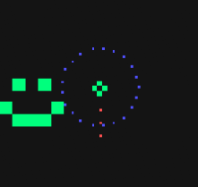
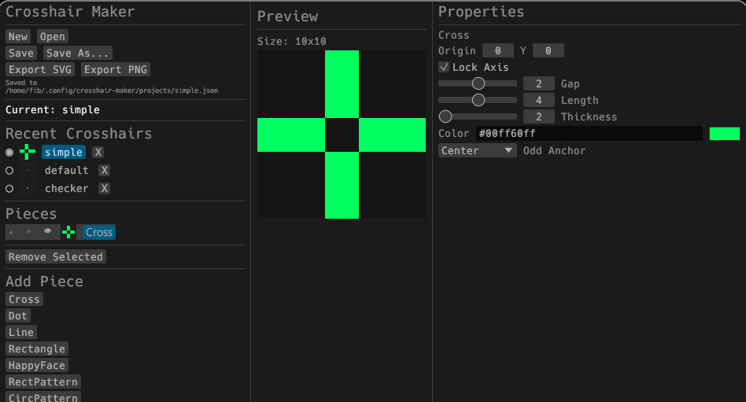

# crosshair-maker


Crosshair overlay creator with SVG rendering and preview.





## Install

### AUR

```bash
yay -S crosshair-maker
```

### From source

```bash
git clone https://github.com/fibsussy/crosshair-maker.git
cd crosshair-maker
cargo build --release
```

## Usage

```bash
crosshair-maker
```

Launch from your app menu or run `crosshair-maker` in a terminal.

## krosshair integration

crosshair-maker works out of the box with [krosshair](https://github.com/fibsussy/krosshair), a Vulkan crosshair overlay for Linux. The currently selected crosshair is automatically exported to `~/.config/crosshair-maker/projects/current.png`, which krosshair picks up as its default — just launch your game with `KROSSHAIR=1` and go.

To test the full setup together with `vkcube`:

```sh
$ yay -Sy krosshair crosshair-maker vulkan-tools
$ KROSSHAIR=1 vkcube &
$ crosshair-maker &
```

## License

GPL-3.0
